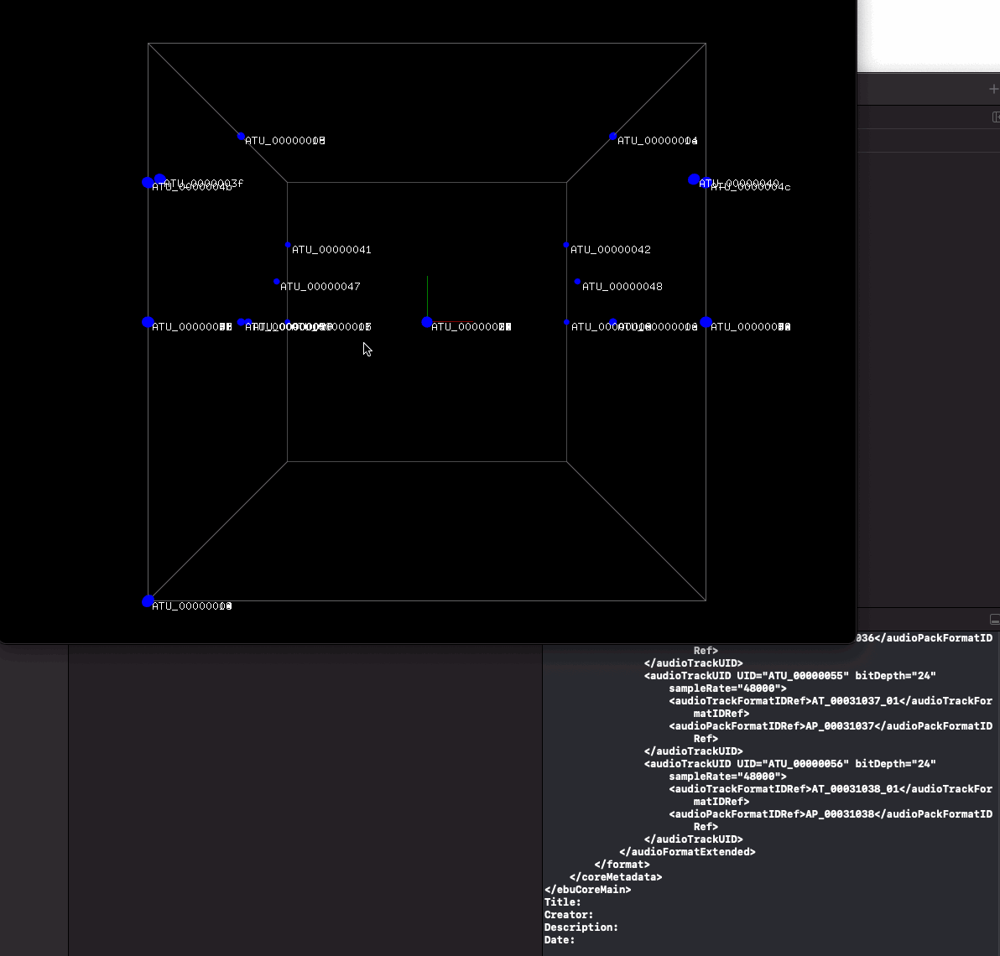

# m1-admparser
This repo is a collection of tools and research to help utilize, debug and understand ADM & Atmos metadata specs and to help tool for transcodings to/from [Mach1Transcode API](https://github.com/Mach1Studios/m1-sdk/tree/master/executables)

### Contents
- `metadata-spec/` contains research on the topic of transcoding to and from ADM metadata driven formats
- `ADMParser/` contains a test metadata parser that converts points to a Mach1 Spatial friendly API, built with [OpenFrameworks](https://openframeworks.cc/)
- `ReaperScript` utility script for importing object panning automation data from Dolby Atmos or ADM metadata to apply directly within Reaper
- [`m1-transcode`](https://github.com/Mach1Studios/m1-sdk/tree/master/executables) binary allows for reading/writing ADM metadata via hardcoded examples

### Setup for ADMParser
- Download OpenFrameworks: https://openframeworks.cc/download/
- Use OpenFrameworks ProjectGenerator to generate the `m1-admparser/ADMParser/` dir for your preferred IDE

### Usage for ADMParser
This is a simple tool to help visualize and debug the printed ADM metadata.

### Using ReaperScript AtmosParser
This script helps convert Atmos metadata into proper automation tracks for Reaper to help breakout an atmos master file into a Reaper session.

- Edit lines 1 & 2 of `ReaperScript/AtmosParser.lua` to point to your local full path of `AtmosParser.lua` and copy and paste the Atmos metadata to that path and supply the filename in line 2
- Highlight and select the track containing the M1-Panner you wish to import the object panning data to
- From Reaper go to `Actions>Show Action List...?`
- Select `New action...`
- `Load ReaScript...` and navigate to the location of the edited `AtmosParser.lua`
- When prompted type in which object ID of the Atmos mix you are importing