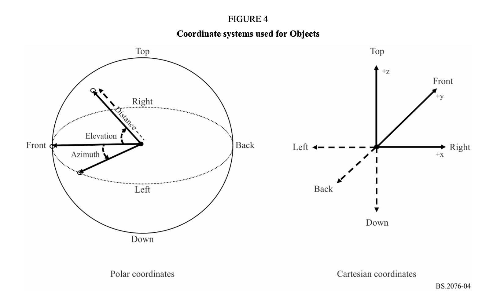

# Mach1 ADM Metadata Research ###

### Description
A look into [EBU ADM](https://github.com/ebu/ebu_adm_renderer) for designing best utilization for Mach1 Spatial APIs.

## Proposed Mach1 Spatial Utilization Architecture

For the purposes of utilization for Mach1Encode & Mach1Transcode APIs, we should parse the following: 
 - `TypeDefinition(Enum)`:
	```    
	DirectSpeakers = 1
    Matrix = 2
    Objects = 3
    HOA = 4
    Binaural = 5
	```
 - If `DirectSpeakers` or `HOA` utilize category (1) for Mach1Encode/Mach1Transcode variables.
 - If `Objects` utilize category (2) for Mach1Encode/Mach1Transcode variables.

## AudioPack/AudioConfiguration/AudioChannel Descriptions
_There are generally two categories of metadata we can use for Mach1 Spatial usecases._

### 1. Surround / Multichannel configurations defined with the following specifications:
    
- [2049_common_definitions.xml](https://github.com/ebu/ebu_adm_renderer/blob/master/ear/fileio/adm/data/2094_common_definitions.xml): This seems to define formats as `audioPackFormatID` and within each `audioPackFormatID` are the definitions for each channel `audioChannelFormatIDRef`.

`audioChannelFormatIDRef` are defined in [line 439+ in 2094_common_definitions.xml](https://github.com/ebu/ebu_adm_renderer/blob/ee74f546dc6a0cb83925418193543a1e5bdf659a/ear/fileio/adm/data/2094_common_definitions.xml#L439) 
 
- [2051_layouts](https://github.com/ebu/ebu_adm_renderer/blob/master/ear/core/data/2051_layouts.yaml): This defines some metadata tags/names for commonly used channels in various surround / multichannel configurations. Uses polar descriptions. 
    
- [allo_positions.yaml](https://github.com/ebu/ebu_adm_renderer/blob/master/ear/core/data/allo_positions.yaml): This is the same as the above but with cartesian descriptions.

### EXAMPLE
[2094_common_definitions.xml: Line 13](https://github.com/ebu/ebu_adm_renderer/blob/ee74f546dc6a0cb83925418193543a1e5bdf659a/ear/fileio/adm/data/2094_common_definitions.xml#L13)
```        
	<audioPackFormat audioPackFormatID="AP_0001000a" audioPackFormatName="urn:itu:bs:775:3:pack:3.0_(0+3+0)" typeLabel="0001" typeDefinition="DirectSpeakers">
          <audioChannelFormatIDRef>AC_00010001</audioChannelFormatIDRef>
          <audioChannelFormatIDRef>AC_00010002</audioChannelFormatIDRef>
          <audioChannelFormatIDRef>AC_00010003</audioChannelFormatIDRef>
        </audioPackFormat>
```
Indicates `audioPackFormatID` = `"AP_0001000a"` with `audioPackFormatName` = `urn:itu:bs:775:3:pack:3.0_(0+3+0)` essentially saying its a 3.0 surround format with the following channels:
```
<audioChannelFormatIDRef>AC_00010001</audioChannelFormatIDRef>
<audioChannelFormatIDRef>AC_00010002</audioChannelFormatIDRef>
<audioChannelFormatIDRef>AC_00010003</audioChannelFormatIDRef>
```
[2049_common_definitions.xml: Line 439](https://github.com/ebu/ebu_adm_renderer/blob/ee74f546dc6a0cb83925418193543a1e5bdf659a/ear/fileio/adm/data/2094_common_definitions.xml#L439)
```
        <audioChannelFormat audioChannelFormatID="AC_00010001" audioChannelFormatName="FrontLeft" typeLabel="0001" typeDefinition="DirectSpeakers">
          <audioBlockFormat audioBlockFormatID="AB_00010001_00000001">
            <speakerLabel>urn:itu:bs:2051:0:speaker:M+030</speakerLabel>
            <position coordinate="azimuth">30.0</position>
            <position coordinate="elevation">0.0</position>
            <position coordinate="distance">1.0</position>
          </audioBlockFormat>
        </audioChannelFormat>
```
We can collect the channel name here:
`audioChannelFormatName` = `FrontLeft`
We can collect the channel's polar description here:
```
<position coordinate="azimuth">30.0</position>
<position coordinate="elevation">0.0</position>
<position coordinate="distance">1.0</position>
```

### 2. Object audio configurations 
Parsing within an `audioBlockFormat` for any `Position:` tags should suffice for Mach1Encode API directly.


## ADM Coordinate System
Discovered and detailed thoroughly [here](https://www.itu.int/dms_pubrec/itu-r/rec/bs/R-REC-BS.2076-2-201910-I!!PDF-E.pdf)



## QA Material
[Download ADM examples](https://ebu.io/qc/testmaterial)

## Define further...


```
audioProgrammes
```
```
audioContents
```
```
audioObjects
```
```
audioPackFormats
```
```
audioChannelFormats
```
```
audioStreamFormats
```
```
audioTrackFormats
```
```
audioTrackUIDs
```